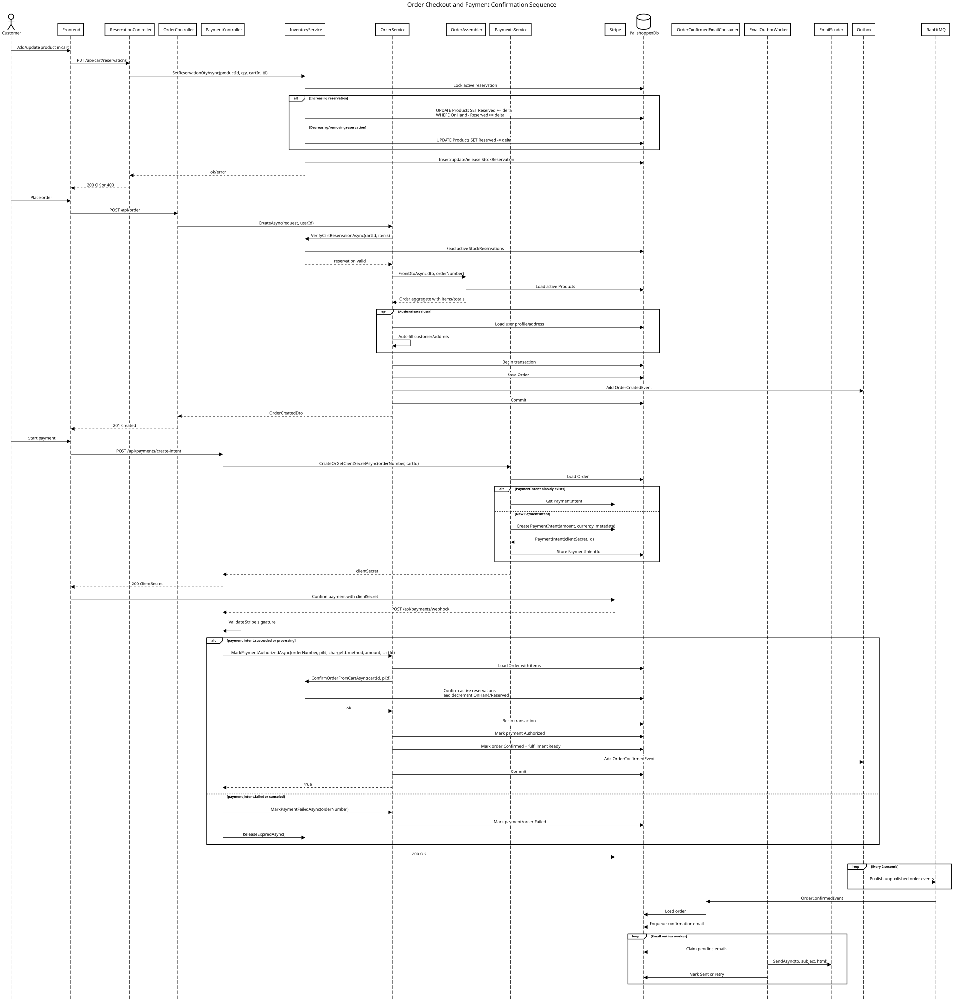

# Pallshoppen Backend

Backend API for Pallshoppen, an e-commerce system for product browsing, cart stock reservations, checkout, payments, fulfillment, customer accounts, and custom quote requests.

## Overview

The API exposes public shop endpoints, authenticated customer endpoints, and admin endpoints. Requests flow through ASP.NET Core controllers into service implementations that use Entity Framework Core directly for persistence and call external integrations such as Stripe, PostNord, Redis, RabbitMQ, Azure Communication Services Email, and Azure Blob Storage.

## Features

- Product catalog with paging, search, filtering, sorting, suggestions, image metadata, and Redis-backed public product caching.
- Admin product management for creating, updating, activating, filtering, and listing products.
- Cart stock reservations with expiration, stock confirmation on payment, and cleanup of expired reservations.
- Order creation, customer/shipping updates before payment authorization, order lookup by id or order number, and customer order history.
- Stripe PaymentIntent creation and webhook handling for successful, processing, failed, and canceled payments.
- PostNord service point lookup and order shipping selection.
- ASP.NET Core Identity registration, login, logout, refresh, email confirmation, password reset, roles, and JWT cookies.
- User profile, address, default address, and authenticated customer order endpoints.
- Admin order listing, details, status changes, tracking number updates, dashboard metrics, and fulfillment queue actions.
- Custom request intake with optional attachment metadata, internal/customer emails, admin quote creation, and quote sending.
- SQL-backed email outbox with Azure Communication Services Email delivery and in-memory rate limiting.
- SQL-backed event outbox published to RabbitMQ through MassTransit for order-related events.
- Health check endpoint for SQL Server.
- OpenAPI document and Scalar API reference.

## Tech Stack

- .NET 10 / ASP.NET Core Web API
- Entity Framework Core 10
- SQL Server
- ASP.NET Core Identity
- JWT Bearer authentication
- Redis through `Microsoft.Extensions.Caching.StackExchangeRedis`
- MassTransit 9 with RabbitMQ
- Stripe.net
- Azure Communication Services Email
- Azure Blob Storage
- SixLabors ImageSharp for image resizing/WebP output
- xUnit, FluentAssertions, Respawn, and `Microsoft.AspNetCore.Mvc.Testing` for integration tests
- Docker and Docker Compose
- Scalar for API documentation UI

## Architecture

The solution follows a Clean Architecture-inspired structure with separate `Api`, `Application`, `Domain`, `Infrastructure`, `Contracts`, and `IntegrationTests` projects.

Business logic is implemented in services in the `Infrastructure` layer behind interfaces defined in `Application`. Those services use Entity Framework Core directly through `PallshoppenDbContext` and `AuthDbContext`; the project intentionally avoids a traditional Repository pattern because EF Core already provides repository-like querying, tracking, and unit-of-work behavior, and an extra abstraction would add little value here.

Runtime flow is generally:

```text
Controller -> Application interface -> Infrastructure service -> EF Core / Redis / external integration
```

Order domain events are written to the `OutboxMessages` table inside the same database transaction as order changes, then published by a hosted background worker to RabbitMQ. Emails are queued in the `EmailOutbox` table and delivered by a separate hosted worker.

### Process Diagrams

The checkout and order-processing flow is documented with these UML diagrams:

- [Activity diagram](docs/diagrams/activity-diagram.pdf)
- Sequence diagram:



## Project Structure

```text
Api/
  Controllers/              ASP.NET Core controllers and route definitions
  Authorization/            Email confirmation authorization policy
  Program.cs                Dependency injection, middleware, auth, MassTransit, hosted workers
  Dockerfile                API container build

Application/
  DTOs/                     Request/response DTOs
  Interfaces/               Service contracts used by controllers
  Assemblers/               Mapping from entities to DTOs
  Options/                  Typed options such as fulfillment settings

Domain/
  Entities/                 Products, orders, reservations, outbox, custom requests, identity models
  Enums/                    Product, stock, order, payment, fulfillment, shipping, email statuses
  Factories/                Order and order item construction helpers
  ValueObjects/             Shipping address and payment value objects

Infrastructure/
  Persistence/              EF Core DbContexts, migrations, hosted persistence workers
  Services/                 Product, order, inventory, auth, payment, admin, email, blob, PostNord services
  Messaging/                MassTransit consumers, email templates, outbox serialization
  Seed/                     Product and identity seed data
  Auth/                     JWT options and refresh-token store

Contracts/
  Events/                   Order event contracts published through MassTransit

IntegrationTests/
  Features/                 Product and order integration tests
  Infrastructure/           Test factory, SQL fixture, fakes, Respawn reset setup
```

## Getting Started

### Prerequisites

- .NET SDK 10.0
- Docker Desktop or compatible Docker runtime
- SQL Server, Redis, and RabbitMQ for local runtime
- Stripe credentials for payment intents/webhooks
- PostNord API key for service point lookup
- Azure Communication Services Email connection string for email delivery
- Azure Blob Storage connection string for product image upload processing

### Start Local Dependencies

`docker-compose.dev.yml` starts SQL Server, Redis, RabbitMQ, and Stripe CLI. It does not start the API container.

```bash
docker compose -f docker-compose.dev.yml up -d
```

Local service ports from the compose file:

- SQL Server: `localhost:1433`
- Redis: `localhost:6379`
- RabbitMQ: `localhost:5672`
- RabbitMQ management UI: `http://localhost:15672`

### Configure the API

The repository contains `Api/dummy.appsettings.json` and `Api/dummy.appsettings.Development.json` as examples. The API reads normal ASP.NET Core configuration, so provide the required values through `Api/appsettings.json`, user secrets, or environment variables.

Minimum local configuration must include:

```json
{
  "ConnectionStrings": {
    "DefaultConnection": "Server=localhost,1433;Database=EshopDevDb;User Id=sa;Password=...;TrustServerCertificate=True;Encrypt=False;"
  },
  "Jwt": {
    "Issuer": "Pallshoppen",
    "Audience": "Pallshoppen.Client",
    "Key": "long-signing-key"
  },
  "Stripe": {
    "PublishableKey": "...",
    "SecretKey": "...",
    "WebhookSecret": "..."
  },
  "PostNord": {
    "BaseUrl": "https://atapi2.postnord.com/rest/businesslocation",
    "ApiKey": "..."
  },
  "Redis": {
    "ConnectionString": "localhost:6379"
  },
  "AcsEmail": {
    "ConnectionString": "...",
    "From": "..."
  },
  "CustomRequests": {
    "RecipientEmail": "..."
  },
  "BlobStorage": {
    "ConnectionString": "...",
    "ContainerName": "product-images"
  },
  "App": {
    "PublicBaseUrl": "http://localhost:5173"
  }
}
```

## Configuration / Environment Variables

The following keys are read by the application or Docker Compose:

| Key | Purpose |
| --- | --- |
| `ConnectionStrings:DefaultConnection` / `ConnectionStrings__DefaultConnection` | SQL Server connection string for both `PallshoppenDbContext` and `AuthDbContext`. |
| `Jwt:Issuer` / `Jwt__Issuer` | JWT issuer. |
| `Jwt:Audience` / `Jwt__Audience` | JWT audience. |
| `Jwt:Key` / `Jwt__Key` | JWT signing key. |
| `Jwt:AccessTokenMinutes` / `Jwt__AccessTokenMinutes` | Optional access token lifetime; defaults to 15 minutes. |
| `Jwt:RefreshTokenDays` / `Jwt__RefreshTokenDays` | Optional refresh token lifetime; defaults to 7 days. |
| `Stripe:PublishableKey` / `Stripe__PublishableKey` | Stripe publishable key. |
| `Stripe:SecretKey` / `Stripe__SecretKey` | Stripe secret key; required at startup. |
| `Stripe:WebhookSecret` / `Stripe__WebhookSecret` | Stripe webhook signature secret. |
| `PostNord:BaseUrl` / `PostNord__BaseUrl` | PostNord business location API base URL. |
| `PostNord:ApiKey` / `PostNord__ApiKey` | PostNord API key. |
| `Redis:ConnectionString` / `Redis__ConnectionString` | Redis connection used by distributed cache. |
| `Cache:Enabled` / `Cache__Enabled` | Enables product/admin-order cache behavior; defaults to true in services. |
| `AcsEmail:ConnectionString` / `AcsEmail__ConnectionString` | Azure Communication Services Email connection string. |
| `AcsEmail:From` / `AcsEmail__From` | Sender address/domain for ACS email. |
| `CustomRequests:RecipientEmail` / `CustomRequests__RecipientEmail` | Internal recipient for custom request emails. |
| `EmailRateLimit:Enabled` / `EmailRateLimit__Enabled` | Enables in-memory email send rate limiting. |
| `EmailRateLimit:PerMinute` / `EmailRateLimit__PerMinute` | Email sends allowed per minute; default is 5. |
| `EmailRateLimit:PerHour` / `EmailRateLimit__PerHour` | Email sends allowed per hour; default is 10. |
| `App:PublicBaseUrl` / `App__PublicBaseUrl` | Frontend base URL used in verification and password reset links. |
| `Auth:RequireEmailConfirmation` / `Auth__RequireEmailConfirmation` | Controls password reset behavior for unconfirmed users. |
| `BlobStorage:ConnectionString` / `BlobStorage__ConnectionString` | Azure Blob Storage connection string. |
| `BlobStorage:ContainerName` / `BlobStorage__ContainerName` | Blob container for product images. |
| `Fulfillment:OverdueAfterDays` / `Fulfillment__OverdueAfterDays` | Fulfillment overdue threshold; default is 5 days. |
| `MSSQL_SA_PASSWORD` | SQL Server password used by Docker Compose. |
| `STRIPE_API_KEY` | Used by the Stripe CLI service in `docker-compose.dev.yml`. |

## Running the Application

Restore, build, and run the API:

```bash
dotnet restore Pallshoppen.slnx
dotnet build Pallshoppen.slnx
dotnet run --project Api --launch-profile http
```

The `http` launch profile runs the API at:

```text
http://localhost:5005
```

Useful runtime URLs:

- API reference: `http://localhost:5005/scalar`
- OpenAPI document: `http://localhost:5005/openapi.json`
- Health check: `http://localhost:5005/health`

On startup outside the `Test` environment, the API:

- Applies EF Core migrations for both core and auth DbContexts.
- Seeds product data through `DbSeeder`.
- Seeds `Admin` and `User` roles and a default admin account through `IdentitySeeder`.
- Starts hosted workers for pending order cleanup, stock reservation cleanup, email outbox processing, and event outbox publishing.

## API Endpoints

Main route groups:

- `GET /api/Products` - public product list with paging, query, sorting, type, condition, price, and stock filters.
- `GET /api/Products/{id}` - public product details.
- `GET /api/Products/suggest` - product suggestions.
- `PUT /api/cart/reservations` - set cart reservation quantity for a product.
- `POST /api/Order` - create an order from a reserved cart.
- `GET /api/Order/{id}` and `GET /api/Order/by-number/{orderNumber}` - order lookup.
- `PATCH /api/Order/by-number/{orderNumber}/customer` - update customer details before payment authorization.
- `PATCH /api/Order/by-number/{orderNumber}/shipping-address` - update shipping address before payment authorization.
- `POST /api/payments/create-intent` - create or retrieve a Stripe PaymentIntent client secret.
- `POST /api/payments/webhook` - Stripe webhook endpoint.
- `GET /api/Shipping/service-points` - PostNord service point lookup.
- `PUT /api/Shipping/orders/{orderNumber}/selection` - set PostNord service point shipping selection.
- `POST /api/custom-requests` - submit a custom request form.
- `POST /auth/register`, `/auth/login`, `/auth/logout`, `/auth/refresh` - authentication session endpoints.
- `POST /auth/forgot-password`, `/auth/reset-password`, `/auth/resend-verification`, `/auth/confirm-email` - account recovery and email verification.
- `GET /api/me` - authenticated profile.
- `PUT /api/me/profile`, `POST /api/me/addresses`, `PATCH /api/me/profile/default-address` - authenticated profile/address management requiring the `EmailConfirmed` policy.
- `GET /api/me/orders` and `GET /api/me/orders/{orderNumber}` - authenticated customer order history.
- `POST /api/BlobUpload/request` and `POST /api/BlobUpload/finalize` - product image upload SAS and image variant processing.
- `GET/POST/PUT/PATCH /api/admin/products` - admin product management; requires `Admin` role.
- `GET/PATCH /api/admin/orders` - admin order management; requires `Admin` role.
- `GET /api/admin/dashboard` - admin dashboard metrics; requires `Admin` role.
- `GET/POST /api/admin/custom-requests` and `POST /api/admin/custom-quotes/{id}/send` - admin custom request and quote workflow; requires `Admin` role.
- `GET/POST/PUT /api/AdminFulfillment` - fulfillment queue and fulfillment actions.

JWT bearer authentication reads the access token from the `access_token` HTTP-only cookie. Login and refresh write `access_token`, `refresh_token`, and `uid` cookies with `Secure=true` and `SameSite=None`.

## Database / Persistence

The application uses SQL Server through EF Core with two DbContexts sharing the same connection string:

- `PallshoppenDbContext` uses the `core` schema for products, product images, orders, order items, stock reservations, email outbox messages, event outbox messages, custom requests, custom quotes, and custom quote items.
- `AuthDbContext` uses the `auth` schema for ASP.NET Core Identity users, roles, claims, logins, tokens, user profiles, and user addresses.

Migrations are stored under `Infrastructure/Migrations` and `Infrastructure/Migrations/Auth`. Startup migration history tables are configured separately:

- `core.__EFMigrationsHistory`
- `auth.__EFMigrationsHistory`

Important persistence behavior:

- Products track `OnHand` and `Reserved` quantities.
- Stock reservations are unique per active cart/product pair.
- Orders own shipping address and payment value objects.
- Order numbers are unique.
- Order and quote monetary values use decimal precision configured in EF Core.
- Email delivery and message publication use database outbox tables.

## Messaging / Background Jobs

MassTransit is configured with RabbitMQ and these receive endpoints:

- `order-cache` consumes order status/tracking events and invalidates admin order cache entries.
- `order-email-shipped` consumes order status/tracking events and queues shipped emails.
- `order-email-confirmed` consumes order confirmed events and queues confirmation emails.

Hosted services outside the `Test` environment:

- `DatabaseInitializerHostedService` applies migrations and seeds initial data.
- `PendingCleanupService` deletes pending orders older than 30 minutes when no PaymentIntent exists.
- `StockReservationDeleteService` releases expired stock reservations about once per minute with backoff on failure.
- `EmailOutboxWorker` claims pending email rows and sends them through Azure Communication Services Email.
- `OutboxPublisherService` publishes unpublished order events from SQL Server to RabbitMQ.

## Docker / Deployment

Build and run the API, SQL Server, and Redis from `docker-compose.yml`:

```bash
docker compose up --build
```

Run local dependencies only from `docker-compose.dev.yml`:

```bash
docker compose -f docker-compose.dev.yml up -d
```

Run integration tests in Docker:

```bash
docker compose -f docker-compose.test.yml up --build --abort-on-container-exit
```

The API Dockerfile builds `Api/Api.csproj`, publishes the application, installs `curl` for health checks, and runs `dotnet Api.dll` on port `8080`.

## Tests

Integration tests are in `IntegrationTests` and use:

- `WebApplicationFactory<Program>`
- SQL Server
- EF Core migrations
- Respawn database resets
- A fake inventory service in the test web host

Direct test command:

```bash
dotnet test IntegrationTests/IntegrationTests.csproj
```

For direct local test runs, set:

```bash
ConnectionStrings__DefaultConnection="Server=localhost,1433;Database=EshopTestDb;User Id=sa;Password=...;TrustServerCertificate=True;Encrypt=False;"
```

## Known Limitations

- `dotnet run --project Api --launch-profile http` requires a valid MassTransit 9 license through `MT_LICENSE` or `MT_LICENSE_PATH`; without it, startup fails during bus configuration.
- `docker-compose.yml` starts the API, SQL Server, and Redis, but `Program.cs` configures MassTransit to connect to RabbitMQ at `localhost` and the compose file does not define a RabbitMQ service for the API container.
- `docker-compose.dev.yml` includes RabbitMQ, but `Program.cs` still hardcodes RabbitMQ host `localhost`, username `guest`, and password `guest` instead of reading broker settings from configuration.
- The repository contains `Api/dummy.appsettings.json`, but no real `Api/appsettings.json`; local configuration must be provided before running.
- Startup seeding creates a default admin user in code. Change or remove seeded credentials before using this outside local development.
